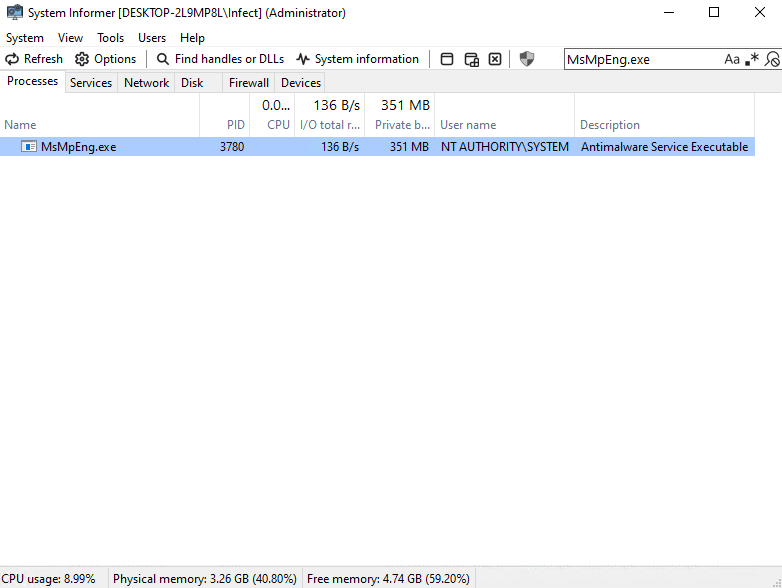
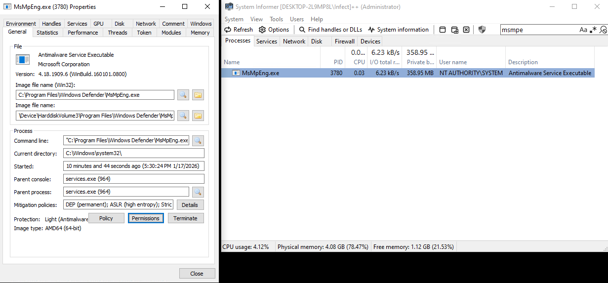
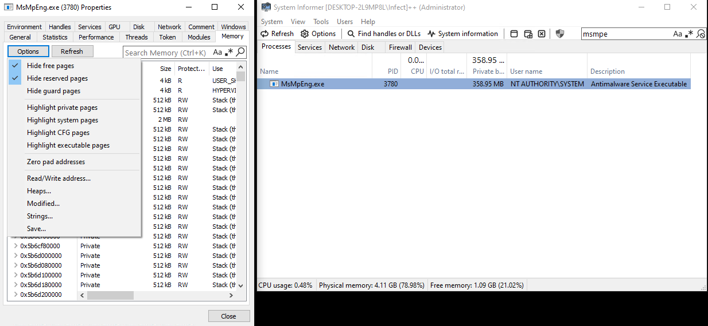
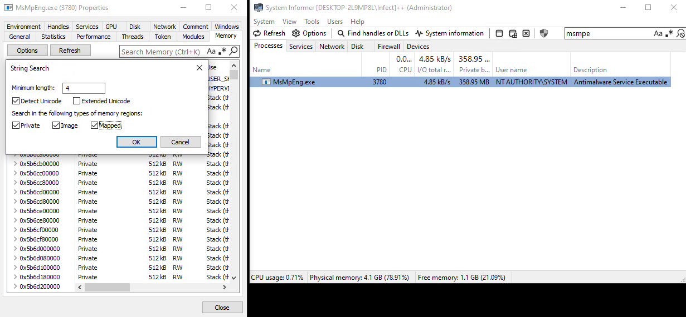
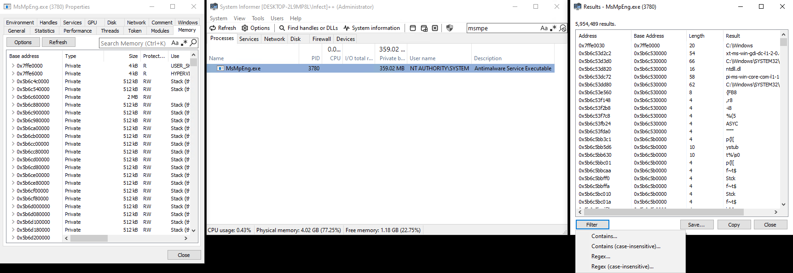
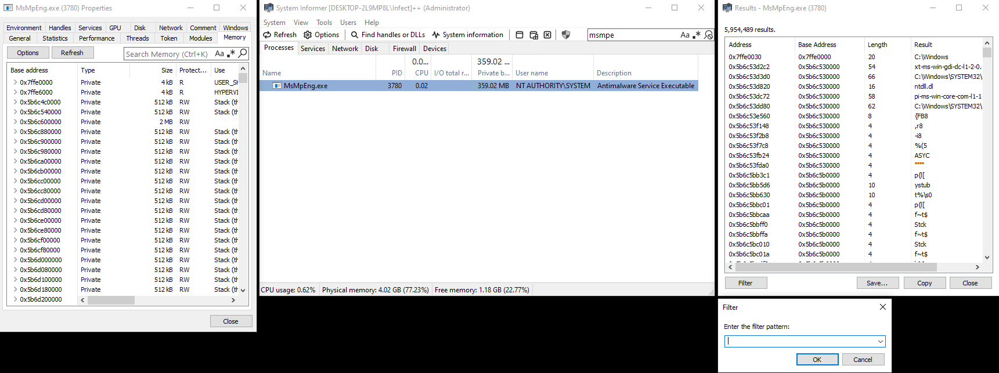
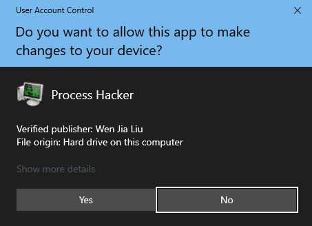
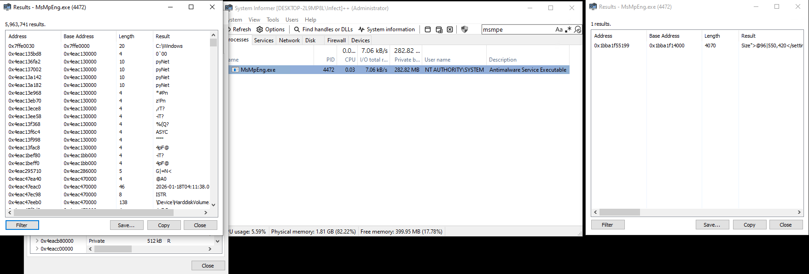

### MsMpEng.exe
> Short for Microsoft Malware Protection Engine.
**NOTE: You need a kernel driver to read and or write memory from this process. The easiest way to do this is to enable the option in System Informer and run in administrator, or install Process Hacker 2 (as by default, it has it enabled).

### Explanation
> MsMpEng.exe resides as a core process within Windows for Windows Defender, the pre-installed antimalware on all Windows systems. This process actively scans files, memory, and network activity.

> More likely then not, unless disabled, or using another antimalware software: if a person is going to run an executable, whether a cheat for a game, or malware, MsMpEng.exe will scan the file.

> Some cheat developers will digitally sign their executable and obtain a code-signing certificate. MsMpEng.exe is likely to have traces of the signature or flag of the executable that was ran on the system.

### Steps
> 1. Open up System Informer (or your application of choice, but it's very important that the application used kernel-level)

> 2. Once open, filter or search for the process name. In this case, MsMpEng.exe

> 3. Open the properties of the process. Easiest way of doing this is double clicking the process, or right clicking, then finding the "Properties" button.

> 4. You'll be prompted a new window, the properties window. In this window, you should see the memory tab. Click it once to display the base address, types, size, and other properties of memory in MsMpEng.exe

> 5. Now, we want to click the "Strings" option which will prompt a new window. In the window, we should edit the filters for the string search. Ensure that the minimum length is 4, and ensure that the only checked boxes are 'Detect Unicode', 'Private', 'Image', and 'Mapped'

> 6. Now, press 'OK'. There should be a new window prompted, filtered with what we inputted last step. We're going to want to narrow our search even further, so we're going to click 'Filter', then 'Contains (case-insensitive).

> 7. Once again, a new window titled 'Filter' pops up, telling us to enter the filter pattern. Here, it gets somewhat local. Say, you ran a cheat (or any executable in that matter) that you know is a signed executable. For an example, I'll run 'Process Hacker 2' as an administrator, signed by 'Wen Jia Liu.' In the filter, I'll search for 'Wen Jia Liu' and press enter. If 'Wen Jia Liu' show ups in any form, this indicates that the executable I ran, 'Process Hacker 2', was ran in the instance of this Windows until reset of the computer, reset of the service MsMpEng.exe, or shutdown.
 

### Additional Notes
> Note that if I hadn't ran the executable from the time frame I start my computer and login, nothing would've shown as the process wouldn't have to scan the file and its signatures. One more note, the name of the publisher does not change unless the developer finds a way to spoof it for everytime their program is downloaded or compiled. This means that if person A, person B, and person C both have 'Process Hacker 2', the publisher's name is going to be the same. This applies the same way to cheat executables and or malware if signed.

