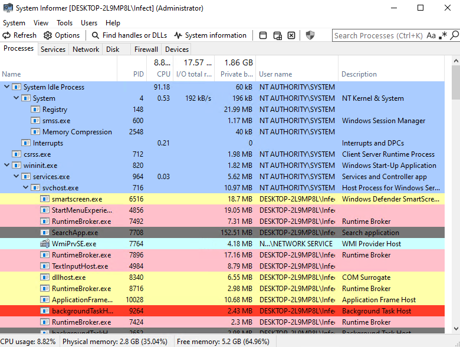
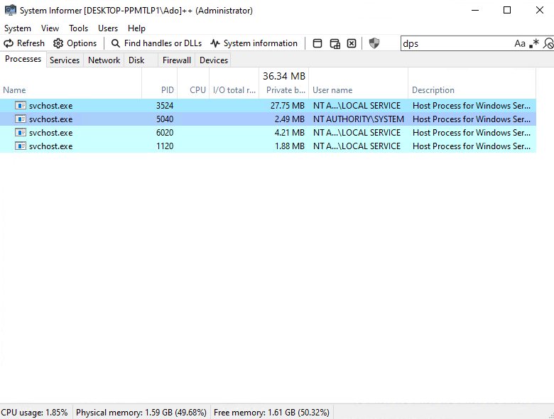
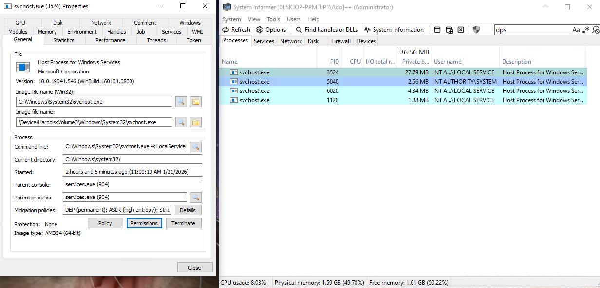
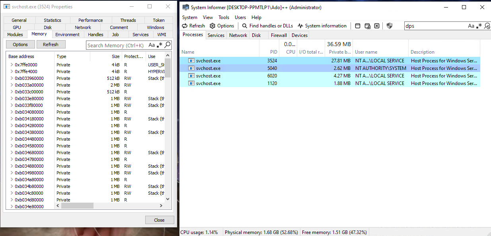
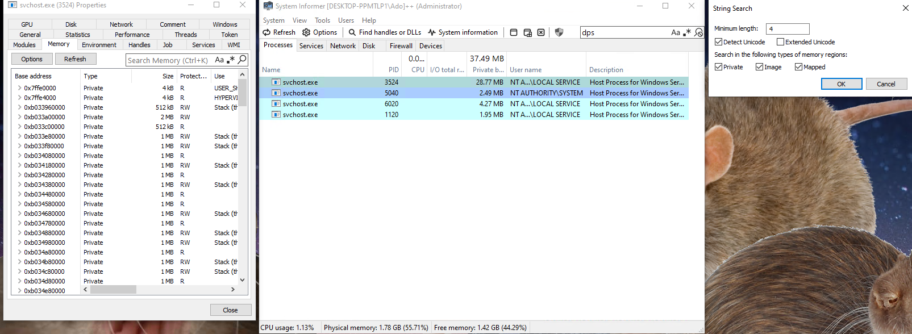
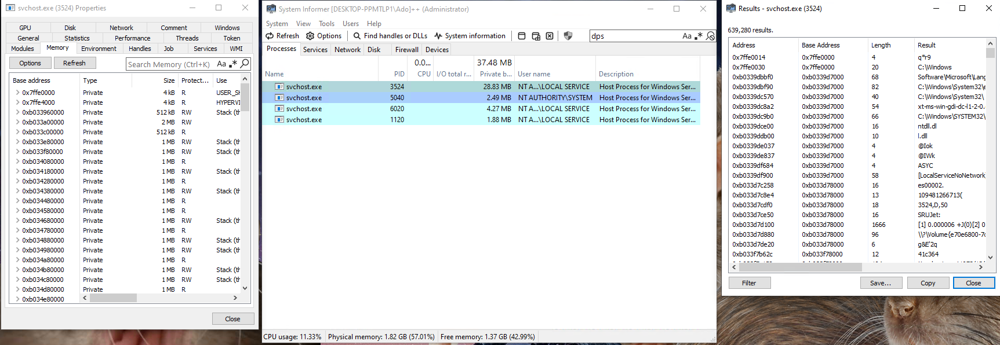
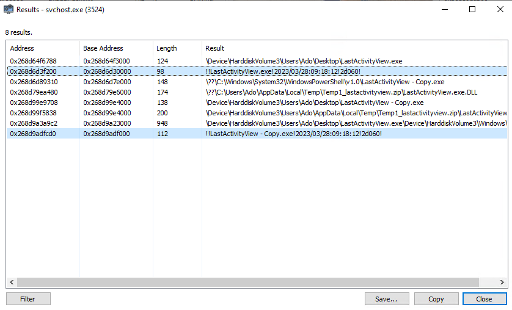

### svchost.exe | DPS
> Short for Diagnostic Policy Service.
**NOTE: You do not need a kernel driver to read and or write memory from this process, like some other processes.

### Explanation
> Diagnostic Policy Service resides as a core service within svchost.exe 

> On Windows, you've probably ran a portable executable. These executables have headers that contain information like the compilation timestamp, which is a 32-bit value, representing the time passed since Unix epoch. 

> More likely then not, an executable isn't going to be recompiled every single download-though it is possible and there are instances of this occuring. This process isn't always reliable in detecting cheats or malware. If you can that the timestamp of one executable isn't modified and matches the same executable from another source or download, only then is it a good indication that the timestamps match, and is likely that executable is what you put out to be. (It's also very unlikely that you have the exact same timestamp as some random executable on your computer, unless spoofed)

### Steps
> 1. Open up System Informer (or your application of choice). For this example.

> 2. Once open, filter or search for the process name. In this case, since System Informer is amazing, you won't have to hover over every single svchost.exe process running. You can just simply type DPS, or the full name of the service, which narrows it down a ton.

> 3. Open the properties of the process. Easiest way of doing this is double clicking the process, or right clicking, then finding the "Properties" button.

> 4. You'll be prompted a new window, the properties window. In this window, you should see the memory tab. Click it once to display the base address, types, size, and other properties of memory in svchost.exe.

> 5. Now, we want to click the "Strings" option which will prompt a new window. In the window, we should edit the filters for the string search. Ensure that the minimum length is 4, and ensure that the only checked boxes are 'Detect Unicode', 'Private', 'Image', and 'Mapped'.

> 6. Now, press 'OK'. There should be a new window prompted, filtered with what we inputted last step. We're going to want to narrow our search even further, so we're going to click 'Filter', then 'Contains (case-insensitive).

> 7. Once again, a new window titled 'Filter' pops up, telling us to enter the filter pattern. Here, it depends on what you're checking for. In this case, I ran LastActivityView, which doesn't destruct their strings in memory in the Diagnostic Policy Service in svchost.exe. This is useful as we can get a string timestamp that is specific to this compiled version of LastActivityView. In reality, the likelyhood of any executable being compiled in on the exact same day, hour, minute, and second is extremely unlikely, almost impossible.
What is possible though, is changing the name of the executable; though it does not change the string timestamp. If the string timestamp matches whatever executable you're comparing, it  indicates that the same cheat or malware analyzed in a different environment was likely ran on the current system.
As an example, I attached two images. One showcases the original named executable of LastActivityView, and another shows same executable with a different file name (which is just a copy). Notice that the timestamp does not change.

### Additional Notes
#### TODO